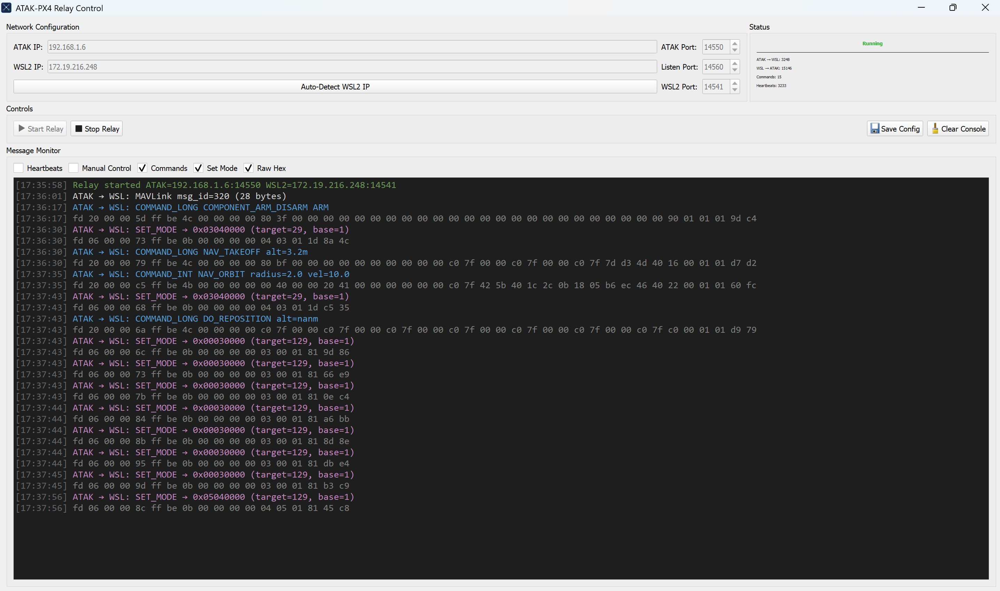

# ATAK-PX4 Integration Bridge

A bidirectional MAVLink bridge that enables ATAK (Android Team Awareness Kit) to control PX4 drones through a Windows to WSL2 to PX4 SITL relay setup.

## Architecture

```
ATAK Phone <-> Windows (atak_relay_gui.py) <-> WSL2 (wsl_forwarder.py) <-> PX4 SITL
    14550        14550 <-> 14560                  14541 <-> 14540
```

## Project Structure

```
uas_plugin_tak/
  README.md
  todo.md
  windows/                    # Runs on Windows host
    atak_relay_gui.py          - Qt GUI relay (primary)
    wsl_to_atak_relay.py       - CLI relay (fallback)
    generate_icon.py           - Generates app_icon.ico
    app_icon.ico               - Taskbar icon
    setup_windows.bat          - Windows environment setup
  wsl/                        # Runs inside WSL2
    wsl_forwarder.py           - MAVLink bridge to PX4
    diagnostic.py              - PX4 system diagnostics
    test_direct_command.py     - PX4 command testing
    setup_wsl.sh               - WSL2 environment setup
  docs/                       # Screenshots and images
    menu.png
    QtMenu.png
```

## Quick Start

### Prerequisites

- **Windows 11/10** with WSL2 enabled
- **PX4 SITL** running in WSL2
- **ATAK** app on Android device
- **Python 3.8+** on both Windows and WSL2
- **PyQt5** (`pip install PyQt5`)

### 1. Setup Windows Environment

Run in **PowerShell as Administrator**:
```powershell
cd windows
.\setup_windows.bat
```

### 2. Setup WSL2 Environment

Run in **WSL2 terminal**:
```bash
cd wsl
chmod +x setup_wsl.sh
./setup_wsl.sh
```

### 3. Start PX4 SITL (WSL2)

```bash
# In WSL2 PX4 directory
make px4_sitl gz_x500_gimbal

# In PX4 console, set parameters for external control:
param set COM_RC_IN_MODE 0
param set COM_ARM_WO_GPS 1
param set COM_ARM_AUTH_REQ 0
param save
commander mode manual
```

### 4. Start Bridge Services

**Both services must be running for the bridge to work.**

**Terminal 1 (WSL2) - REQUIRED:**

The WSL2 forwarder is the critical link between Windows and PX4. Without it, no MAVLink traffic reaches the drone.

```bash
cd wsl
python3 wsl_forwarder.py
```

Wait until you see `Got heartbeat! Bidirectional forwarding active...` before starting the Windows relay.

**Terminal 2 (Windows) - GUI mode (recommended):**
```powershell
cd windows
python atak_relay_gui.py
```

The GUI window will open with fields for ATAK IP, WSL2 IP, and ports.
Click **Start Relay** to begin forwarding.

**Alternative - command-line mode:**
```powershell
cd windows
python wsl_to_atak_relay.py
```

### 5. Configure ATAK

On your ATAK device:
1. Go to **Settings > Network Preferences > Streaming**
2. Add connection:
   - **Address:** `<Windows_IP>:14550`
   - **Protocol:** UDP
   - **Role:** Server

## GUI Features



The Qt relay app (`atak_relay_gui.py`) provides:

- **Network Configuration** - Editable IP and port fields with auto-detect for WSL2 IP
- **Start/Stop Controls** - Start and stop the relay without restarting the app
- **Save/Load Config** - Persist settings to `relay_config.json` across sessions
- **Live Message Monitor** - Color-coded console showing decoded MAVLink traffic
- **Message Filters** - Toggle visibility of Heartbeats, Manual Control, Commands, Set Mode, and Raw Hex
- **Traffic Statistics** - Live counters for messages in each direction
- **Custom Taskbar Icon** - Shows a dedicated icon instead of the default Python icon

### Regenerating the Icon

If `app_icon.ico` is missing, regenerate it:
```powershell
pip install Pillow
cd windows
python generate_icon.py
```

## Configuration

### Network Configuration

The GUI lets you configure all network settings directly. Fields are saved with the **Save Config** button.

**Default ports:**
- `14550` - ATAK MAVLink port
- `14560` - Listen port (receives from WSL2)
- `14541` - WSL2 command port

**wsl_forwarder.py (WSL2):**
- `WINDOWS_HOST = '192.168.192.1'` - Windows host gateway
- `FORWARD_PORT = 14560` - Sends data to Windows
- `PX4_PORT = 14540` - PX4 SITL MAVLink port

## Usage

### Supported ATAK Commands

- **ARM/DISARM** - Arm or disarm the drone
- **TAKEOFF** - Takeoff to specified altitude
- **LANDING** - Land at current position
- **WAYPOINT NAVIGATION** - Send GPS waypoints
- **SET MODE** - Switch flight modes (HOLD, LAND, MANUAL)
- **ORBIT** - Orbital flight patterns

### Command Flow

1. Send command from **ATAK interface**
2. **Windows relay** forwards to WSL2
3. **WSL2 forwarder** decodes MAVLink and sends to PX4
4. **PX4 responses** flow back to ATAK

### Troubleshooting

Enable **Raw Hex** and **Commands** filters in the GUI to see all traffic.

**Common Issues:**

- **"ARM Temporarily Rejected"** - Check PX4 safety parameters
- **"No ATAK connection"** - Verify device IP and firewall settings
- **"Commands not reaching PX4"** - Ensure WSL2 IP is correct
- **"Failed to bind sockets"** - Another instance may be running on the same ports

**PX4 Safety Parameters:**
```bash
# Allow external arming
param set COM_ARM_AUTH_REQ 0
# Disable RC requirement
param set COM_RC_IN_MODE 0
# Allow GPS-free arming
param set COM_ARM_WO_GPS 1
```

## Network Ports

| Port  | Service          | Direction          |
|-------|------------------|--------------------|
| 14540 | PX4 SITL MAVLink | WSL2 <-> PX4      |
| 14541 | Command Relay    | WSL2 <- Windows    |
| 14550 | ATAK MAVLink     | Windows <-> ATAK   |
| 14560 | Status Relay     | Windows <- WSL2    |

## Packaging as .exe

To distribute as a standalone Windows executable:
```powershell
pip install pyinstaller
cd windows
pyinstaller --onefile --windowed --icon=app_icon.ico atak_relay_gui.py
```
The result will be in `dist/atak_relay_gui.exe`.

## License

Open source project for ATAK and PX4 development.
